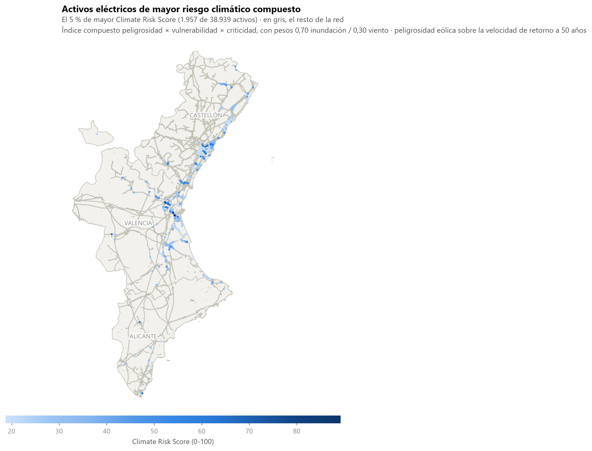
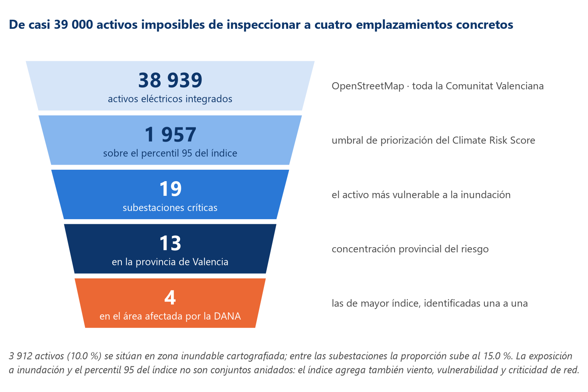
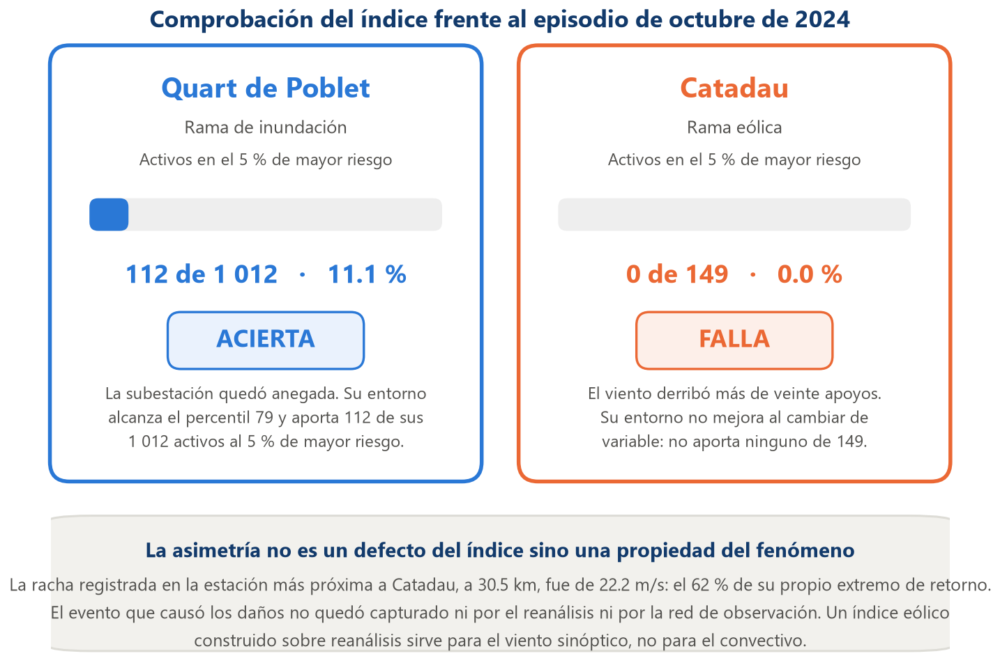

# Riesgo climático en infraestructura eléctrica de la Comunitat Valenciana

Piloto experimental que ordena por riesgo climático los activos de la red
eléctrica —subestaciones y apoyos de línea— **a nivel de activo individual y
usando solo fuentes públicas**, sin datos propietarios de las distribuidoras.
Combina dos amenazas de naturaleza distinta, inundación y viento extremo, en un
índice compuesto, y contrasta el resultado contra un episodio real: la DANA del
29 de octubre de 2024.

Trabajo de Fin de Máster. El código, los datos derivados y las figuras que
sustentan la memoria están aquí; la memoria en sí no se versiona.

## En un vistazo

**Qué sale.** De los 38 939 activos de la red, el índice señala los 1 957 que
superan el percentil 95, entre ellos 19 subestaciones.



**Para qué sirve.** Convierte un inventario inabarcable en una lista de
inspección manejable.



**Qué tan bien funciona.** Contrastado contra la DANA de octubre de 2024, el
resultado es deliberadamente asimétrico: la rama de inundación acierta y la
eólica falla, y el porqué de ese fallo es el hallazgo más interesante del
trabajo.



## Qué produce

| Salida | Fichero |
|---|---|
| Base geoespacial de 38 939 activos con sus variables de amenaza | `activos_con_crs_v6.csv` (derivado, se regenera) |
| Índice compuesto **Climate Risk Score** y su parametrización | `crs_parametros_v6.json` |
| Dos agrupamientos: territorial y por mecanismo de riesgo | `clustering_metricas.json`, `clustering_perfiles_v6.json`, `perfiles_amenaza_v6.csv` |
| Modelo supervisado de inundabilidad y explicabilidad SHAP | `modelado_metricas.json` |
| Contraste frente al episodio de octubre de 2024 | `validacion_dana.json`, `evento_dana_observado.json` |
| Ajuste de extremos sobre observaciones de AEMET | `extremos_observados.json`, `v50_estaciones.csv` |
| 20 figuras a 220–300 ppp | `figuras/` |

## Resultados principales

- **38 939 activos** integrados (608 subestaciones y 38 331 apoyos), de los que el
  **10,0 %** está en zona inundable; entre las subestaciones sube al **15,0 %**.
- La peligrosidad eólica se construye sobre la **velocidad de retorno a 50 años**
  y se normaliza contra la velocidad básica de diseño del CTE DB-SE-AE (29 m/s).
  Resultado: **ningún emplazamiento de la Comunitat alcanza la velocidad con la
  que se dimensionan sus propios apoyos** (máximo 24,55 m/s).
- Con el umbral del percentil 95 (**CRS ≥ 18,71**), el conjunto crítico son
  **1 957 activos**, entre ellos **19 subestaciones** (13 en Valencia, 5 en
  Alicante, 1 en Castellón).
- El modelo supervisado alcanza **ROC-AUC 0,841** con validación por bloques
  espaciales de 10 × 10 km, frente a 0,948 con partición aleatoria. Esa brecha
  —0,31 puntos de PR-AUC— es autocorrelación espacial, no capacidad predictiva,
  y se reporta a propósito.
- **La comprobación frente a la DANA sale asimétrica**: la rama de inundación
  identifica el entorno de la subestación anegada de Quart de Poblet (112 de sus
  1 012 activos en el 5 % superior, percentil 79), y la rama eólica no detecta
  Catadau (0 de 149), donde el viento derribó más de veinte apoyos. La estación
  de AEMET más próxima registró aquellos días el 62 % de su propio extremo de
  retorno: el fenómeno fue convectivo y de escala inferior a la de cualquier
  reanálisis. El índice sirve para viento sinóptico, no para el convectivo.

## Requisitos

Python 3.12.10 y las versiones exactas de `requirements.txt`, que son las que
produjeron los resultados publicados.

```
py -3.12 -m venv .venv
.venv\Scripts\activate
pip install -r requirements.txt
```

## Datos: dónde viven y cómo obtenerlos

Los datos de origen **no están en el repositorio**: pesan demasiado y varios
tienen licencias propias. Se descargan con los scripts `01`, `03`, `03b` y
`descargar_topografia.py` a una carpeta externa que se indica por variable de
entorno:

| Variable | Para qué sirve | Valor por defecto |
|---|---|---|
| `TFM_DATA_DIR` | Carpeta de los datos descargados | `~/TFM_local/data` |
| `AEMET_API_KEY_FILE` | Fichero con la clave de AEMET OpenData | `~/TFM_local/aemet_api_key.txt` |
| `TFM_CONTACTO` | Contacto opcional en la cabecera `User-Agent` de las descargas | vacío |

```
set TFM_DATA_DIR=D:\ruta\a\los\datos
set AEMET_API_KEY_FILE=D:\ruta\privada\aemet_api_key.txt
set TFM_CONTACTO=tu.correo@ejemplo.com
```

Los valores por defecto cuelgan del directorio personal del usuario, de modo que
los scripts funcionan en cualquier máquina sin editarlos. **La clave de AEMET
nunca se guarda en el repositorio**: se lee de un fichero externo. Identificarse
con `TFM_CONTACTO` es cortesía hacia servidores públicos como Overpass y Zenodo,
pero es opcional.

| Fuente | Qué aporta | Acceso |
|---|---|---|
| OpenStreetMap (Overpass API) | Subestaciones y apoyos | Abierto, ODbL |
| PATRICOVA (Generalitat Valenciana) | Peligrosidad por inundación, 6 niveles | Abierto |
| Pryor y Barthelmie (2021), Zenodo `10.5281/zenodo.4306822` | Velocidad de retorno a 50 años | Abierto |
| AEMET OpenData | Rachas diarias 1985–2024, 13 estaciones | Requiere clave gratuita |
| Copernicus DEM GLO-30 | Altitud y pendiente | Abierto |
| Red de Cauces del Institut Cartogràfic Valencià | Distancia al cauce | Abierto |
| Global Wind Atlas | Velocidad media, usada como predictor topográfico | Abierto |

## Cadena de ejecución

Los scripts están numerados por orden y ninguno sobrescribe las entradas del
anterior; las descargas se cachean.

**Extracción e integración**

```
DownloadSubstationsInfo_comentado.py     Overpass: subestaciones
DownloadApoyosElectricosInfo_comentado.py  Overpass: apoyos
descargar_topografia.py                  Copernicus DEM y Red de Cauces
generar_variables_climaticas.py          cruce con PATRICOVA y muestreo del ráster
```

**Índice, agrupamientos y modelado**

```
climate_risk_score.py        índice v5 (viento medio)
clustering_subestaciones.py  agrupamiento territorial, k = 8
modelado_inundabilidad.py    Random Forest / XGBoost + SHAP
```

**Versión vigente del índice (V6)**

```
00_baseline_v5.py            reproduce y verifica las cifras de la v5
01_descargar_viento_extremo.py   atlas de extremos desde Zenodo
02_extraer_v50.py            extracción del campo V50 sobre la Comunitat
03_descargar_rachas_aemet.py     rachas diarias (requiere clave)
03b_completar_series_largas.py   completa las series desde 1985
04_crs_v6.py                 índice V6, pesos 0,70 / 0,30, y perfiles de amenaza
05_validacion_y_cifras.py    contraste frente al episodio y cifras de viento
06_extremos_observados.py    Gumbel / GEV / POT con IC bootstrap
07_calibrar_v50.py           prueba de falsación de la variante escalada
08_evento_dana_observado.py  rachas observadas durante el episodio
15_cifras_documento.py       recalcula todas las cifras que cita la memoria
```

**Figuras**

```
generar_figuras.py               figuras 1 a 10
10_figuras_v6_adicionales.py     perfiles, sensibilidad y mapas provinciales
13_rehacer_figura25.py           contraste frente a la DANA
16_figuras_conceptuales.py       embudo de priorización y objetivos
```

Los scripts `09`, `11`, `12`, `14`, `17`, `19`, `20` y `21` manipulan el
documento de la memoria y solo son útiles con el `.docx`, que no se versiona.
`18_verificar_v14.py` comprueba que ninguna cifra antigua sobrevive en él.

## Reproducibilidad

- **Semilla fija 42** en todo lo que tiene aleatoriedad: K-Means, Random Forest,
  XGBoost, la partición aleatoria de control y el muestreo para SHAP. La
  validación por bloques espaciales usa `GroupKFold`, que es determinista y no
  admite semilla.
- **Sistema de referencia**: los datos llegan en EPSG:4326 y todo cálculo métrico
  —distancias, radios, densidades, bloques— se hace en **EPSG:25830**
  (ETRS89 / UTM 30N). Los cruces con PATRICOVA usan `predicate="within"` sin
  tolerancia; la distancia a zona inundable, `sjoin_nearest` sin distancia máxima.
- **OpenStreetMap cambia de forma continua**: una extracción posterior no
  devolverá necesariamente los mismos 38 939 activos.

## Lo que no está en el repositorio

Los borradores de la memoria (19 ficheros, 86 MB), las tablas intermedias
pesadas (42 MB, regenerables con la cadena anterior) y los datos brutos de AEMET,
cuya redistribución es una decisión de licencia distinta de publicar el código.
Todo ello está en `.gitignore` con el motivo anotado junto a cada bloque.

## Licencia y atribución

El **código** de este repositorio se publica bajo licencia **MIT** (ver
[`LICENSE`](LICENSE)): puedes usarlo, modificarlo y redistribuirlo citando la
autoría.

Los **datos no están cubiertos por esa licencia**. Los ficheros de activos
derivan de OpenStreetMap y están sujetos a la **Open Database License (ODbL)**,
que obliga a atribuir a *OpenStreetMap contributors* y a compartir igual
cualquier base derivada. El resto de resultados incorporan además PATRICOVA, el
atlas de Pryor y Barthelmie, AEMET OpenData, el Copernicus DEM GLO-30 y la Red
de Cauces del Institut Cartogràfic Valencià; cada fuente conserva sus propios
términos, y están citadas en la tabla de fuentes de más arriba.
